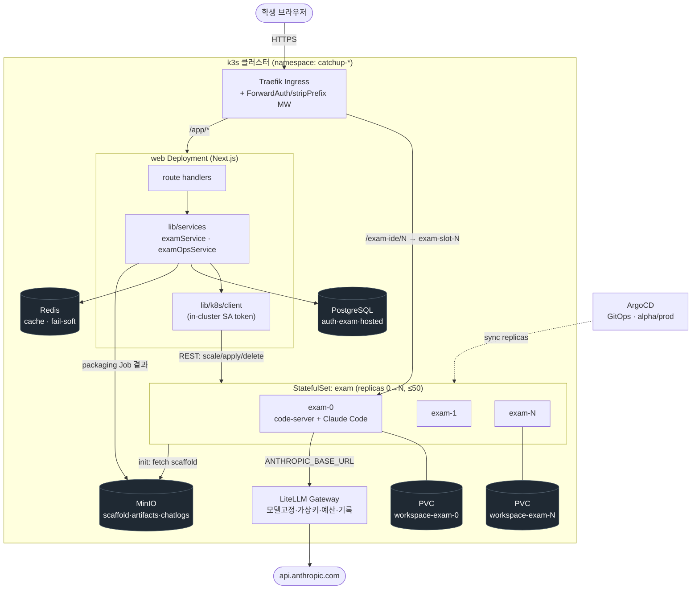
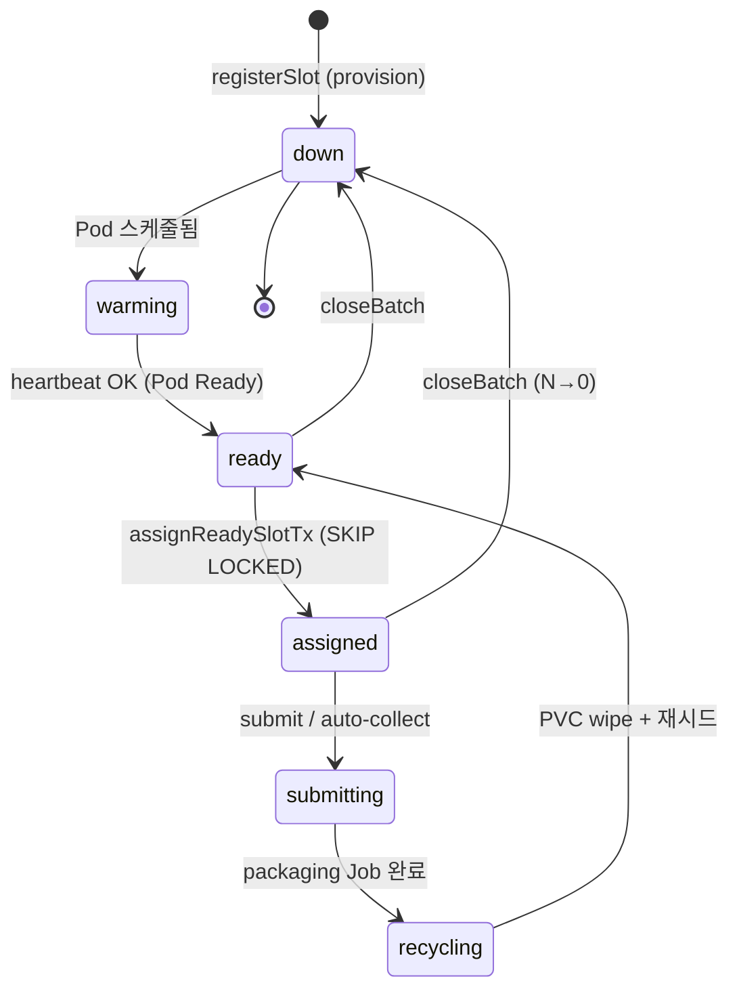
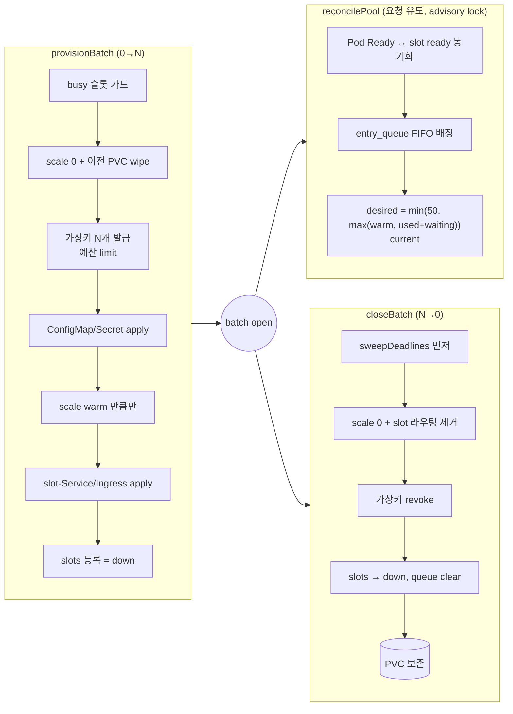

# 회차별 시험 환경 동작 원리 (개발자용)

> 학생 개개인에게 격리된 코딩 컨테이너를 **할당 → 운영 → 회수**하는 메커니즘을 한눈에.
> 상세 설계는 [2-exam-environment.md](2-exam-environment.md) · [5-storage-submission-pipeline.md](5-storage-submission-pipeline.md),
> 코드 진입점은 [`examService.ts`](../apps/web/lib/services/examService.ts) ·
> [`examOpsService.ts`](../apps/web/lib/services/examOpsService.ts) · [`k8s/client.ts`](../apps/web/lib/k8s/client.ts).

---

## 0. 핵심 설계 명제

| # | 명제 | 구현 근거 |
|---|---|---|
| 1 | **상태의 정답지는 DB.** 슬롯 배정·마감·소유권은 코드가 아니라 Postgres 제약이 강제 | `hosted.slots` (`attempt_id UNIQUE`, `(batch_id,slot_no)` PK) |
| 2 | **Hot path / Cold path 분리.** 학생 대기 구간은 DB 트랜잭션 1회, 회차 규모 작업만 k8s API | `startExam` (tx) vs `provisionBatch` (k8s) |
| 3 | **per-student 격리는 StatefulSet ordinal로 고정.** Service가 라운드로빈하지 않고 특정 Pod 지정 | `statefulset.kubernetes.io/pod-name` selector |
| 4 | **클라이언트 불신.** 마감 재판정·작업물 캡처는 서버가 수행 | `autoCollectAttempt`(deadline 재검사), packaging Job(PVC readOnly) |

---

## 1. 전체 구조도

**egress 차단**: exam Pod은 NetworkPolicy로 외부망이 막혀 있고 `litellm` + DNS만 허용 → 진짜 API 키는 게이트웨이만 보유.

---

## 2. API 흐름 ① — 시험 시작 (Hot Path)

`startExam(attemptId, examineeId)` — [`examService.ts`](../apps/web/lib/services/examService.ts). **동시 클릭 안전의 핵심**.

```mermaid
sequenceDiagram
    autonumber
    participant B as 브라우저
    participant R as route handler
    participant S as examService
    participant DB as Postgres (tx)
    participant P as Pool reconcile

    B->>R: POST /api/exam/:id/start
    R->>S: startExam(attemptId, examineeId)
    S->>DB: findRuntimeForExaminee (소유권·상태 확인)
    Note over S,DB: submitted/expired면 즉시 거부

    rect rgb(30,40,55)
    Note over S,DB: withTransaction (원자 구간)
    S->>DB: startRunningTx → status=running, deadline_at 설정(서버)
    S->>DB: findSlotByAttemptTx (재시작 멱등 확인)
    alt 미배정 & 대기열 비어있음
        S->>DB: assignReadySlotTx<br/>UPDATE ... FOR UPDATE SKIP LOCKED LIMIT 1
        Note over DB: 동시 N명 → 각자 다른 slot_no
    else ready 슬롯 없음
        S->>DB: enqueueTx (entry_queue FIFO)
    end
    S->>DB: addEventTx('started', {slotNo, queued})
    end

    S-->>R: {ok, deadlineAt, queued}
    R-->>B: iframe src = /exam-ide/{slotNo}
    S-)P: reconcilePool(batchId) (커밋 후 비동기, fail-soft)
```

이후 매 IDE 요청은 Traefik **ForwardAuth → `/api/internal/exam-authz`** 로 "세션 유효 + 경로 slotNo == 배정 slotNo"를 검사한 뒤 `exam-slot-N` 으로 프록시됩니다.

---

## 3. API 흐름 ② — 제출 & 패키징 (Cold Path 회수)

```mermaid
sequenceDiagram
    autonumber
    participant Trigger as 제출/만료/스윕
    participant S as examService
    participant DB as Postgres
    participant K as k8s API
    participant J as packaging Job
    participant M as MinIO

    alt 학생 제출
        Trigger->>S: submitExam()
    else 시간 만료 (서버 재판정)
        Trigger->>S: expireExam() / sweepDeadlines()
        Note over S: deadline_at > now() 면 회수 안 함
    end

    rect rgb(30,40,55)
    S->>DB: lock → status submitted, slot.state=submitting
    S->>DB: addEventTx('submitted' | 'auto_collected')
    end

    S->>K: POST Job (pkg-{slot}-{attempt})
    activate J
    J->>J: initC pack: tar workspace + sha256<br/>(PVC readOnly 마운트)
    J->>M: mc cp workspace.tgz / chatlog.tgz
    J->>S: POST /api/internal/submissions/package (callback)
    deactivate J
    S->>DB: submission accepted (trust=verified)
```

> **불변 순서**: 취합(패키징)이 끝나기 전에 PVC를 지우지 않는다. `closeBatch`도 **sweep → scale-down** 순서.

---

## 4. 슬롯 상태 머신

`hosted.slots.state` — [`0008_slot_window_states.sql`](../db/migrations/0008_slot_window_states.sql).

---

## 5. 회차 생명주기 & 워밍 풀 reconcile

**warm 정책** (`warm_count`, commit `943909f`): `NULL`=정원 전수, 값 지정 시 "그 비율(예 20%)만 선기동 + 초과 수요는 도착분만". `used+waiting`이 warm을 넘으면 실수요만큼만 띄워 헤드룸 0.

**스케일 적용 경로** (명제 2의 cold path):
- **local(k3d)**: web Pod이 in-cluster SA 토큰으로 `scaleStatefulSet` 직접 호출.
- **alpha/prod**: `catchup-helm/batches/current.yaml` 에 replicas 커밋 → **ArgoCD auto-sync**.

---

## 6. 자원 통제 요약

| 축 | 상한 | 위치 |
|---|---|---|
| 컴퓨트 | `requests 500m/2Gi · limits 2cpu/4Gi` | exam StatefulSet container |
| 스토리지 | PVC 2Gi/슬롯 (volumeClaimTemplates) | StatefulSet |
| 동시성 | 슬롯 ≤ 50 / StatefulSet | `Math.min(capacity, 50)` |
| AI 예산 | 가상키별 `max_budget_usd` | LiteLLM `/key/generate` |
| 모델 | `claude-haiku-4-5` 강제 (SSOT: helm `examPlatform.litellm.model`) | [`infra/litellm/config.yaml`](../infra/litellm/config.yaml) |
| 네트워크 | egress = litellm + DNS only | NetworkPolicy |

---

## 7. 파일 맵

| 관심사 | 경로 |
|---|---|
| Hot path (start/submit/expire/sweep) | [`apps/web/lib/services/examService.ts`](../apps/web/lib/services/examService.ts) |
| Cold path (provision/close/reconcile/package) | [`apps/web/lib/services/examOpsService.ts`](../apps/web/lib/services/examOpsService.ts) |
| 슬롯/대기열 repo | [`apps/web/lib/db/repositories/slots.ts`](../apps/web/lib/db/repositories/slots.ts) · [`entryQueue.ts`](../apps/web/lib/db/repositories/entryQueue.ts) |
| k8s 최소 클라이언트 | [`apps/web/lib/k8s/client.ts`](../apps/web/lib/k8s/client.ts) |
| 동적 매니페스트 빌더 | [`apps/web/lib/k8s/examResources.ts`](../apps/web/lib/k8s/examResources.ts) |
| StatefulSet/Service/Ingress (local) | [`deploy/local-k3d/40-exam.yaml`](../deploy/local-k3d/40-exam.yaml) · [`55-exam-ide.yaml`](../deploy/local-k3d/55-exam-ide.yaml) |
| 배포 차트 (alpha/prod) | [`catchup-helm/templates/exam-statefulset.yaml`](../catchup-helm/templates/exam-statefulset.yaml) |
| 운영 CLI | [`deploy/local-k3d/exam-ops.sh`](../deploy/local-k3d/exam-ops.sh) |
